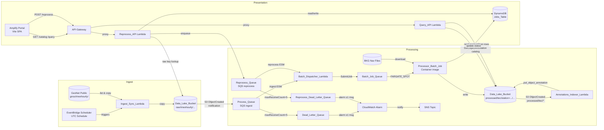
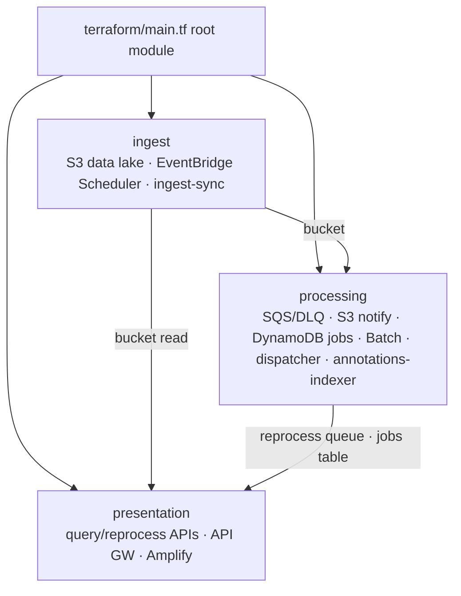

# Design Document

## Overview

This design describes a consolidated AWS event-driven serverless platform for GNSS RINEX data ingestion, PyTECGg TEC calibration, and interactive visualization. The platform is provisioned through Terraform-only infrastructure-as-code within a single monorepo.

The system follows a three-layer event-driven architecture:

1. **Ingest Layer** — An EventBridge Scheduler schedule (default: hourly UTC) triggers a Lambda function to sync recent RINEX observation files from GeoNet's public S3 bucket into a private data lake, using a 2-hour rolling lookback to tolerate one missed run.
2. **Processing Layer** — S3 ObjectCreated events flow through SQS to a batch-dispatcher Lambda that submits AWS Batch jobs on Fargate Spot. The processor container runs PyTECGg calibration, writes processed output under `processed/tec/`, and triggers an annotations indexer that writes Amazon S3 Annotations on each output object.
3. **Presentation Layer** — An Amplify-hosted SPA queries processed data via API Gateway (`/catalog`, `/query`, `/reprocess`) and allows reprocessing with allowlisted parameters.

### Design Decisions

| Decision | Rationale |
|----------|-----------|
| Terraform-only provisioning | A single IaC workflow removes duplication and drift between provisioning systems, and keeps all infrastructure changes reviewable in one toolchain. |
| External container image for processor | `ghcr.io/platformfuzz/tec-processor-image` is built and published independently; this repo consumes it as an immutable artifact mirrored to ECR. Local processor source code is not maintained here. |
| SQS standard queue (not FIFO) | Processing order is irrelevant; standard queues provide higher throughput and simpler configuration. |
| Parquet as primary output format | Columnar format enables efficient range scans for the Query API. JSON output is also enabled as a fallback when `pyarrow` is unavailable in the Lambda runtime. |
| Deterministic output keys | Enables safe overwrites for idempotent reprocessing without deduplication logic. |
| S3 Annotations for processed metadata | Station/date catalog metadata lives on each processed object via `PutObjectAnnotation`/`GetObjectAnnotation`, avoiding a separate metadata database. |
| DynamoDB for job tracking only | Low-latency single-item lookups by `job_id` for reprocess jobs; no relational joins needed. |
| Visibility timeout 900s | Matches Lambda max timeout to prevent duplicate processing during long calibrations. |
| Python 3.14 for zip Lambdas | Ingest, query, reprocess, and annotations-indexer use managed runtime `python3.14`. Processor is a container image (Python 3.13). |
| boto3 >= 1.43 for annotation Lambdas | S3 Annotations API requires a recent boto3; query-api and annotations-indexer deployment zips bundle pinned boto3 via `scripts/build-lambda-packages.sh`. |
| EventBridge Scheduler (not classic rules) | Dedicated scheduler service with execution roles; better fit for recurring Lambda triggers than legacy EventBridge rules. |

## Architecture



### Infrastructure Layering



## Components and Interfaces

### 1. Ingest_Sync_Lambda (`services/ingest-sync/`)

**Runtime:** Python 3.14

**Trigger:** EventBridge Scheduler schedule

**Environment Variables:**

- `LOOKBACK_HOURS` — Integer (1–168), default 2
- `DATA_LAKE_BUCKET` — Target bucket name
- `SOURCE_BUCKET` — `geonet-open-data`
- `SOURCE_PREFIX` — `gnss/rinexhourly/`

**Interface:**

```python
def handler(event: dict, context: Any) -> dict:
    """
    Returns:
        {"synced": int, "skipped": int, "errors": int, "prefixes_scanned": list[str]}
    """
```

**Internal Functions (pure, testable):**

```python
def compute_doy_prefixes(current_utc: datetime, lookback_hours: int) -> list[tuple[int, int]]:
    """Return list of (year, doy) tuples covering the lookback window."""

def compute_rolling_window(current_utc: datetime, lookback_hours: int) -> tuple[datetime, datetime]:
    """Return [start, end) UTC window where start = current_utc - lookback_hours."""

def validate_lookback_hours(value: str | None) -> int:
    """Parse and validate LOOKBACK_HOURS. Raises ValueError on invalid input."""

def derive_raw_key(year: int, doy: int, filename: str) -> str:
    """Return the canonical raw S3 key: raw/rinexhourly/{year}/{doy:03d}/{filename}"""
```

### 2. Batch_Dispatcher_Lambda (`services/batch-dispatcher/`)

**Runtime:** Python 3.14

**Trigger:** SQS (Process_Queue for ingest, Reprocess_Queue for reprocess jobs — two event source mappings with separate `maximum_concurrency` limits)

**Environment Variables:**

- `BATCH_JOB_QUEUE_NAME` — Processor Batch job queue name
- `BATCH_JOB_DEFINITION_NAME` — Processor Batch job definition name
- `AWS_REGION_NAME` — AWS region metadata for Batch SubmitJob context

**Interface:**

```python
def handler(event: dict, context: Any) -> dict:
    """Submit one Batch job per SQS record. Returns batchItemFailures when SubmitJob fails."""
```

**Behavior:**

1. Skip S3 `TestEvent` bodies
2. Pass the raw SQS body via `containerOverrides.command` as `["--event-json", "<body>"]`
3. Merge reprocess `parameters` into container environment overrides
4. Call `batch:SubmitJob` once per message

### 3. Processor Batch job (container image)

**Deployment:** `terraform/modules/processing` — `aws_batch_job_definition` with image synced to ECR via `scripts/sync-processor-image.sh` from `ghcr.io/platformfuzz/tec-processor-image`.

**Runtime:** Python 3.13 container on AWS Batch Fargate Spot (`linux/amd64`)

**Trigger:** AWS Batch job queue (`processor-job-queue`)

**Environment Variables:**

- `SOURCE_BUCKET` — Data lake bucket name (read raw RINEX)
- `SOURCE_PREFIX` — Prefix for raw RINEX objects (e.g. `raw/rinexhourly/`)
- `DESTINATION_BUCKET` — Data lake bucket name (write processed output)
- `DESTINATION_PREFIX` — Prefix for output objects (e.g. `processed/tec/`)
- `--event-json` CLI argument — Raw SQS body passed by batch-dispatcher command override
- `NAV_DAY_OFFSET` — Integer, default 1 (overridable per reprocess message)
- `SAVE_PARQUET` — Boolean string, default "true"
- `SAVE_CSV` — Boolean string, default "false"
- `SAVE_JSON` — Boolean string, default "true"
- `SAVE_STATIC_PLOTS` — Boolean string, default "false"
- `SAVE_INTERACTIVE_PLOTS` — Boolean string, default "false"
- `JOBS_TABLE_NAME`

**Interface:**

```python
def main() -> int:
    """Process a single payload provided via --event-json in container mode."""
```

**Processing pipeline:**

1. `s3:GetObject` — read raw RINEX observation from `SOURCE_BUCKET` / `SOURCE_PREFIX` using message `key`
2. Download BKG BRDC navigation for `(nav_year, nav_doy)` via PyTECGg (`nav_day_offset`)
3. PyTECGg calibration on observation + navigation inputs
4. Encode to enabled output formats and `s3:PutObject` to deterministic `DESTINATION_PREFIX/...` keys
5. Best-effort DynamoDB status for job-linked messages

**Forbidden:** synthetic/hardcoded TEC, JSON bodies under `.parquet` keys.

### 4. Annotations_Indexer_Lambda (`services/annotations-indexer/`)

**Runtime:** Python 3.14 (zip deployment with bundled boto3 >= 1.43)

**Trigger:** S3 ObjectCreated on `processed/tec/*`

**Environment Variables:**

- `DATA_LAKE_BUCKET` — Data lake bucket name
- `ANNOTATION_NAMESPACE` — Annotation name (default `processed-metadata`)

**Behavior:**

- Parses `.parquet` and `.json` keys matching `processed/tec/station={station}/year={year}/doy={doy}/{filename}`
- Calls `PutObjectAnnotation` with JSON payload: `dataset`, `station`, `year`, `doy`, `key`, `content_type`, `created_at`
- Idempotent upsert per object key (annotation travels with the asset on reprocess overwrite)

**Shared helper:** `services/shared/s3_annotations.py` (also used by query-api and backfill script)

### 4. Query_API Lambda (`services/query-api/`)

**Runtime:** Python 3.14 (zip deployment with bundled boto3 >= 1.43 for S3 Annotations reads)

**Trigger:** API Gateway GET /query, GET /catalog

**GET /query Parameters:**

- `station` (required) — 4-character identifier
- `start_time` (required) — ISO 8601 UTC
- `end_time` (required) — ISO 8601 UTC
- `sv` (optional) — Satellite identifier

**GET /catalog Parameters:**

- (none) — returns `{"stations": ["AUCK", ...]}`
- `station` (optional) — returns `{"dates": [{"year": 2026, "doy": 176}, ...]}`

**GET /query Response (200):**

```json
{
  "data": [{"epoch": "...", "sv": "...", "id_arc": 1, ...}],
  "meta": {"row_count": 1234, "truncated": false}
}
```

**Internal Functions (pure, testable):**

```python
def validate_query_params(params: dict) -> dict:
    """Validate station, start_time, end_time, sv. Raises ValidationError with field details."""

def resolve_parquet_keys(station: str, start_time: datetime, end_time: datetime) -> list[str]:
    """Derive S3 prefixes for processed data files covering the time range."""

def filter_rows(rows: list[dict], start_time: datetime, end_time: datetime, sv: str | None) -> list[dict]:
    """Filter rows by time range and optional satellite. Pure function."""

def truncate_results(rows: list[dict], max_rows: int = 10000) -> tuple[list[dict], bool]:
    """Return (truncated_rows, was_truncated)."""

def list_catalog_stations_from_annotations(...) -> list[str]:
    """List processed keys, read S3 Annotations in parallel, return unique stations."""

def list_catalog_dates_from_annotations(...) -> list[tuple[int, int]]:
    """List processed keys for a station, read annotations, return unique (year, doy) pairs."""
```

**Catalog behavior:** Lists `processed/tec/**` data keys (`.parquet`/`.json`), reads `processed-metadata` annotations via `GetObjectAnnotation`, aggregates station/date metadata. No DynamoDB catalog table.

**Query behavior:** Reads Parquet (preferred) or JSON from S3; sanitizes non-finite floats (`NaN`/`Inf` → `null`) before JSON serialization.

### 5. Reprocess_API Lambda (`services/reprocess-api/`)

**Runtime:** Python 3.14

**Trigger:** API Gateway POST /reprocess, GET /reprocess/{job_id}

**POST Body:**

```json
{
  "station": "AUCK",
  "year": 2024,
  "doy": 150,
  "parameters": {
    "NAV_DAY_OFFSET": 2
  }
}
```

Allowed override keys: `NAV_DAY_OFFSET`, `SAVE_PARQUET`, `SAVE_CSV`, `SAVE_JSON`, `SAVE_STATIC_PLOTS`, `SAVE_INTERACTIVE_PLOTS`.

**Raw key resolution:** Lists `raw/rinexhourly/{year}/{doy}/` and selects the matching object key (raw files are not annotated).

**Internal Functions (pure, testable):**

```python
def validate_reprocess_request(body: dict) -> dict:
    """Validate station (4-char alphanumeric), year (2000-2099), doy (1-366), optional params.
    Raises ValidationError."""

def build_queue_message(station: str, year: int, doy: int, params: dict, job_id: str, trace_id: str) -> dict:
    """Construct the SQS message body for the Reprocess_Queue."""
```

### 6. Portal (`web/`)

**Runtime:** Node.js 20+, Vite, SPA

**Static assets:** Vite serves files from `web/public/` at the site root. The portal favicon is `web/public/favicon.svg`, referenced from `web/index.html` via `<link rel="icon" href="/favicon.svg" type="image/svg+xml" />` and copied into `dist/` on build.

**Key Modules:**

- `api.ts` — API client for Query_API (`/catalog`, `/query`) and Reprocess_API
- `stores/` — State management (stations, selected parameters, job status)
- `components/TimeSeries.vue|tsx` — Time-series chart (epoch vs vtec/stec/veq)
- `components/IppMap.vue|tsx` — Geographic IPP map with vtec color coding
- `components/ParameterPanel.vue|tsx` — View and processing parameter controls
- `components/StationBrowser.vue|tsx` — Station list and date selection

### 7. Terraform Modules (`terraform/`)

Each layer module follows the pattern: `terraform/modules/{layer}/{*.tf}` with `variables.tf` and `outputs.tf`.

| Module | Key Resources | Inputs | Outputs |
|--------|--------------|--------|---------|
| `ingest` | S3 data lake bucket, EventBridge Scheduler schedule + execution role, ingest-sync Lambda | source_bucket, lookback_hours, source_prefix, schedule_expression | bucket_name, bucket_arn, bucket_id, function_arn |
| `processing` | Process_Queue, Reprocess_Queue, DLQs, redrive policies, S3→SQS notification (raw), S3→Lambda notification (processed/tec), DynamoDB Jobs_Table, Batch compute/queue/job definition, batch-dispatcher Lambda, annotations-indexer Lambda | bucket_arn, bucket_id, bucket_name, aws_region | queue_arn, queue_url, reprocess_queue_arn, reprocess_queue_url, dlq_arn, reprocess_dlq_arn, jobs_table_name, jobs_table_arn, dispatcher_function_arn, batch_job_queue_name |
| `presentation` | query-api Lambda, reprocess-api Lambda, API Gateway REST API, Amplify app | bucket_name, reprocess_queue_url, reprocess_queue_arn, jobs_table_name, jobs_table_arn, web_source_dir, amplify_domain | api_url, app_domain |
| `observability` | CloudWatch alarms, SNS topic, CloudWatch dashboard | aws_region, queue names, lambda names, batch queue name | alarm_topic_arn, dashboard_name |

### 8. Root Terraform Composition (`terraform/main.tf`)

**Responsibilities:**

- Instantiate four modules (`ingest`, `processing`, `presentation`, `observability`) with explicit input/output wiring
- Configure region and shared tagging/conventions
- Ensure ingest scheduling inputs are parameterized (including `LOOKBACK_HOURS` constraints)
- Deploy all Lambda functions with AWS managed runtime `python3.14`
- Define dependency ordering through module references instead of hard-coded identifiers

## Data Models

### SQS Message Schema

The processor consumes from **Process_Queue** (S3 ingest notifications) and **Reprocess_Queue** (Reprocess API direct payloads) via the batch-dispatcher Lambda, which submits one AWS Batch job per message. Message bodies use the same normalized schema:

```json
{
  "bucket": "string — Data_Lake_Bucket name",
  "key": "string — S3 object key (raw/rinexhourly/{year}/{doy}/{filename})",
  "event_time": "string — ISO 8601 UTC timestamp of S3 event",
  "attempt": "integer — derived from ApproximateReceiveCount",
  "trace_id": "string | null — UUID v4 correlation ID; required for reprocess messages, optional for S3-origin messages (processor container generates if absent)",
  "job_id": "string | null — present only for reprocessing jobs",
  "parameters": "object | null — override processing params for reprocessing"
}
```

### DynamoDB Jobs_Table Schema

| Attribute | Type | Description |
|-----------|------|-------------|
| `job_id` (PK) | String | UUID v4 |
| `station` | String | 4-character GNSS station |
| `year` | Number | 4-digit year |
| `doy` | Number | Day of year (1–366) |
| `parameters` | Map | Processing parameter overrides |
| `status` | String | One of: queued, processing, completed, failed |
| `output_key` | String | S3 key of parquet output (set on completion) |
| `error_type` | String | Exception class name (set on failure) |
| `error_message` | String | Error details (set on failure) |
| `trace_id` | String | UUID v4 correlation ID |
| `created_at` | String | ISO 8601 UTC |
| `updated_at` | String | ISO 8601 UTC |

### S3 Annotations Metadata Schema (`processed-metadata` namespace)

Written on processed `.parquet` and `.json` objects by Annotations_Indexer_Lambda:

| Field | Type | Description |
|-------|------|-------------|
| `schema_version` | String | Metadata schema version (currently `"1"`) |
| `dataset` | String | Always `"processed"` |
| `station` | String | Lowercase 4-character station code |
| `year` | Number | 4-digit year |
| `doy` | Number | Day of year |
| `key` | String | Full processed S3 object key |
| `content_type` | String | Object content type or `unknown` |
| `created_at` | String | ISO 8601 UTC |

Catalog endpoints list processed keys and read these annotations in parallel (`GetObjectAnnotation`). There is no cross-bucket annotation search API and no DynamoDB catalog table.

### Parquet Output Schema

| Column | Type | Description |
|--------|------|-------------|
| `epoch` | Timestamp | Observation epoch (UTC) |
| `sv` | String | Satellite vehicle identifier |
| `id_arc` | Int32 | Arc identifier |
| `lat_ipp` | Float64 | IPP latitude (degrees) |
| `lon_ipp` | Float64 | IPP longitude (degrees) |
| `azi` | Float64 | Azimuth (degrees) |
| `ele` | Float64 | Elevation (degrees) |
| `bias` | Float64 | Receiver bias estimate |
| `stec` | Float64 | Slant TEC (TECU) |
| `vtec` | Float64 | Vertical TEC (TECU) |
| `veq` | Float64 | Equivalent vertical TEC |

### S3 Key Patterns

| Prefix | Pattern | Example |
|--------|---------|---------|
| Raw ingest | `raw/rinexhourly/{year}/{doy}/{filename}` | `raw/rinexhourly/2024/150/auck1500.24o` |
| Processed | `processed/tec/station={station}/year={year}/doy={doy}/{source_stem}.{ext}` | `processed/tec/station=auck/year=2024/doy=150/auck1500.parquet` |

### Query API Response Schema

```json
{
  "data": [
    {
      "epoch": "2024-05-29T01:00:00Z",
      "sv": "G01",
      "id_arc": 1,
      "lat_ipp": -36.85,
      "lon_ipp": 174.76,
      "azi": 45.2,
      "ele": 30.1,
      "bias": 0.5,
      "stec": 12.3,
      "vtec": 8.7,
      "veq": 9.1
    }
  ],
  "meta": {
    "row_count": 1,
    "truncated": false
  }
}
```

## Correctness Properties

*A property is a characteristic or behavior that should hold true across all valid executions of a system — essentially, a formal statement about what the system should do. Properties serve as the bridge between human-readable specifications and machine-verifiable correctness guarantees.*

The following properties apply to the pure logic functions in this platform (key parsing, time computations, parameter validation, filtering). They do NOT apply to the IaC layer (Terraform), AWS service integrations, or UI rendering — those are covered by smoke tests, integration tests, and component tests respectively.

### Property 1: Rolling Window Computation

*For any* valid UTC datetime and any LOOKBACK_HOURS value in the range [1, 168], the computed rolling window SHALL have its start exactly LOOKBACK_HOURS hours before the given UTC time, and its end equal to the given UTC time, forming a half-open interval [start, end).

**Validates: Requirements 1.2**

### Property 2: DOY Prefix Completeness

*For any* valid half-open UTC time interval, the set of (year, doy) prefixes returned by `compute_doy_prefixes` SHALL include every UTC calendar day that overlaps with any portion of the interval, and SHALL NOT include any (year, doy) pair whose entire calendar day falls outside the interval. When the interval spans a year boundary, both years' DOY values SHALL be present.

**Validates: Requirements 1.3**

### Property 3: Raw Key Round-Trip

*For any* valid year (4-digit integer), DOY (1–366), station (4-character identifier), and filename string, constructing a raw key via `derive_raw_key(year, doy, filename)` and then parsing it via `parse_raw_key` SHALL yield the original year, DOY, station (extracted from filename), and source_stem components. Conversely, for any valid raw key, `derive_raw_key(*parse_raw_key(key))` SHALL produce the original key.

**Validates: Requirements 6.1, 7.1**

### Property 4: Navigation DOY Rollback

*For any* observation year, observation DOY (1–366), and NAV_DAY_OFFSET (positive integer), `compute_nav_doy` SHALL return a (nav_year, nav_doy) where nav_doy is in [1, 365] or [1, 366] for leap years. When observation_doy minus offset is less than 1, the nav_year SHALL be observation_year minus 1 and nav_doy SHALL account for the number of days in the previous year.

**Validates: Requirements 6.3**

### Property 5: Deterministic Output Key Derivation

*For any* valid raw S3 key matching the pattern `raw/rinexhourly/{year}/{doy}/{filename}`, the derived output key SHALL always equal `processed/tec/station={station}/year={year}/doy={doy}/{source_stem}.parquet` where station, year, doy, and source_stem are deterministically extracted from the input key. Calling the derivation multiple times on the same input SHALL produce identical results.

**Validates: Requirements 7.1, 7.4**

### Property 6: Query Time-Range Filtering

*For any* set of parquet rows with epoch timestamps and any inclusive time range [start_time, end_time], `filter_rows` SHALL return only rows whose epoch falls within the inclusive range. If an `sv` filter is provided, all returned rows SHALL additionally have a matching sv value. The output SHALL be a subset of the input with no rows added or modified.

**Validates: Requirements 9.1, 9.2**

### Property 7: Query Missing Parameter Rejection

*For any* request where one or more of the required parameters (station, start_time, end_time) is absent, `validate_query_params` SHALL raise a validation error identifying the specific missing parameter(s).

**Validates: Requirements 9.3**

### Property 8: Query Malformed Parameter Rejection

*For any* station string that is not exactly 4 characters, or any start_time/end_time string that is not a valid ISO 8601 UTC timestamp, or any pair where start_time is chronologically after end_time, `validate_query_params` SHALL raise a validation error identifying the specific malformed parameter.

**Validates: Requirements 9.4**

### Property 9: Result Truncation

*For any* list of rows, `truncate_results(rows, 10000)` SHALL return at most 10,000 rows. If the input length exceeds 10,000, the output length SHALL be exactly 10,000, the truncated flag SHALL be true, and the returned rows SHALL be the first 10,000 of the input. If the input length is at most 10,000, the output SHALL equal the input and the truncated flag SHALL be false.

**Validates: Requirements 9.5**

### Property 10: Reprocess Request Validation

*For any* station string, year integer, and DOY integer, `validate_reprocess_request` SHALL accept the request if and only if station consists of exactly 4 alphanumeric characters, year is between 2000 and 2099 inclusive, and DOY is between 1 and 366 inclusive. All other combinations SHALL be rejected with an error identifying the invalid parameter.

**Validates: Requirements 10.1, 10.2**

### Property 11: Parameter Merge Correctness

*For any* valid environment defaults map and any subset of override parameters (including empty), `merge_parameters` SHALL produce a result where: (a) every key present in overrides takes the override value, (b) every key NOT in overrides retains the default value, and (c) no keys outside the defined set appear in the result.

**Validates: Requirements 17.1, 17.2, 17.4**

### Property 12: Parameter Type Validation

*For any* parameter value where NAV_DAY_OFFSET is not an integer, or where SAVE_PARQUET, SAVE_CSV, SAVE_STATIC_PLOTS, or SAVE_INTERACTIVE_PLOTS is not a boolean, `validate_processing_params` SHALL reject the input with an error identifying the invalid parameter name and value.

**Validates: Requirements 17.3**

## Error Handling

### Ingest Layer

| Error Scenario | Handling Strategy |
|----------------|-------------------|
| Invalid LOOKBACK_HOURS | Log structured error, terminate invocation (no processing) |
| S3 ListObjects failure for a prefix | Log error with prefix details, continue with remaining prefixes |
| S3 CopyObject failure for a single object | Log error with key details, continue with remaining objects |
| GeoNet bucket temporarily unavailable | Scheduler retries on next scheduled invocation |

### Processing Layer

| Error Scenario | Handling Strategy |
|----------------|-------------------|
| Malformed S3 key in SQS message | Log parse error, do NOT delete message — allow SQS retry then DLQ |
| Navigation file download failure | Log error, do NOT delete message — allow SQS retry then DLQ |
| PyTECGg calibration exception | Log error with stack trace, do NOT delete message |
| Invalid processing parameter types | Log error with param details, do NOT delete message |
| S3 PutObject failure for parquet output | Log error, do NOT delete message |
| S3 PutObjectAnnotation failure (indexer) | Log error, continue with remaining records |
| DynamoDB update failure (job status) | Log error, continue with processing (best-effort status update) |
| Message exceeds maxReceiveCount (5) | Automatic routing to Dead_Letter_Queue, CloudWatch alarm triggers SNS |

### Query/Reprocess API Layer

| Error Scenario | Handling Strategy |
|----------------|-------------------|
| Missing required parameter | HTTP 400 with field-specific error message |
| Malformed parameter value | HTTP 400 with validation details |
| Parquet/JSON file read failure | HTTP 500 with generic error, log details |
| S3 annotation read failure (catalog) | HTTP 500 with generic error, log details |
| DynamoDB GetItem failure | HTTP 500 with generic error, log details |
| Job not found | HTTP 404 with job_id reference |
| SQS SendMessage failure (after job record creation) | Update existing Jobs_Table item status to failed with enqueue error details; return HTTP 500 |

### Portal Layer

| Error Scenario | Handling Strategy |
|----------------|-------------------|
| API network error | Display error toast, retain current view state, offer retry |
| Empty result set | Display informative "no data" message |
| Polling timeout (>5 min) | Stop polling, display timeout indicator |
| Reprocess API error response | Display error details, do not begin polling |

### Observability Standards

All Lambda functions SHALL:

- Emit structured JSON logs (one entry per invocation)
- Include `trace_id` for end-to-end correlation (generate one if upstream payload does not include it)
- Include `duration_ms` for performance monitoring
- Include `outcome` field (success/error)
- On error: include `error_type` (exception class) and `error_message`

## Testing Strategy

### Property-Based Tests (Python — `hypothesis` library)

Property-based tests target the pure logic functions extracted from each Lambda handler. Each property test runs a minimum of 100 iterations with generated inputs.

**Test configuration:** `pytest` + `hypothesis` with `@settings(max_examples=200)`

**Tag format:** `# Feature: event-driven-serverless-platform-demo, Property {N}: {title}`

| Property | Target Function | Module |
|----------|----------------|--------|
| 1: Rolling Window Computation | `compute_rolling_window` | `services/ingest-sync/` |
| 2: DOY Prefix Completeness | `compute_doy_prefixes` | `services/ingest-sync/` |
| 3: Raw Key Round-Trip | `parse_raw_key` / `derive_raw_key` | Processor container image |
| 4: Navigation DOY Rollback | `compute_nav_doy` | Processor container image |
| 5: Deterministic Output Key | `derive_output_key` | Processor container image |
| 6: Query Time-Range Filtering | `filter_rows` | `services/query-api/` |
| 7: Query Missing Param Rejection | `validate_query_params` | `services/query-api/` |
| 8: Query Malformed Param Rejection | `validate_query_params` | `services/query-api/` |
| 9: Result Truncation | `truncate_results` | `services/query-api/` |
| 10: Reprocess Request Validation | `validate_reprocess_request` | `services/reprocess-api/` |
| 11: Parameter Merge Correctness | `merge_parameters` | Processor container image |
| 12: Parameter Type Validation | `validate_processing_params` | Processor container image |

### Unit Tests (Python — `pytest`)

Targeted example-based tests for:

- Trace_ID generation (present/absent scenarios)
- Structured log output format verification
- S3 error continuation behavior (mocked boto3)
- Navigation file download failure handling
- SQS message deletion/non-deletion on success/failure
- API error response format (400, 404, 500)

### Integration Tests

- **Ingest flow**: Mock S3 (moto), verify list/copy logic end-to-end
- **Processing flow**: Mock S3 + SQS (moto), sample RINEX through PyTECGg
- **Query API**: Pre-loaded parquet/json in mock S3, verify `/query` response format and `/catalog` annotation aggregation
- **Annotations indexer**: Mock S3 PutObjectAnnotation, verify key parsing and payload schema
- **Reprocess API**: Mock SQS + DynamoDB + S3 list, verify job creation and raw key resolution

### Infrastructure Tests

- **Terraform**: `terraform validate` and `terraform plan` (no apply) for root and all modules
- **Terraform module isolation**: Each module should `plan` independently with mock inputs

### Frontend Tests (Vitest + Testing Library)

- Component tests for StationBrowser, TimeSeries, IppMap, ParameterPanel
- API client mock tests verifying request/response handling
- Polling behavior tests with timer mocks
- Error state and empty state rendering

### CI Pipeline

The GitHub Actions workflow should run:

1. `terraform validate` on all modules
2. `pytest` (unit + property tests) for each Python service (`ingest-sync`, `query-api`, `reprocess-api`, `annotations-indexer`)
3. `vitest --run` for frontend tests
4. Coverage reporting
