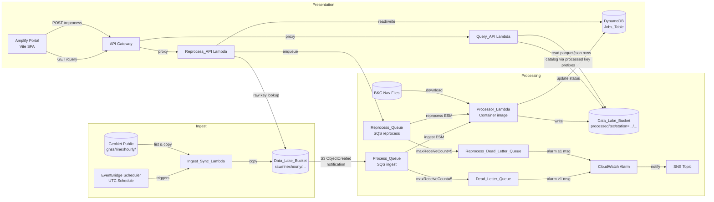
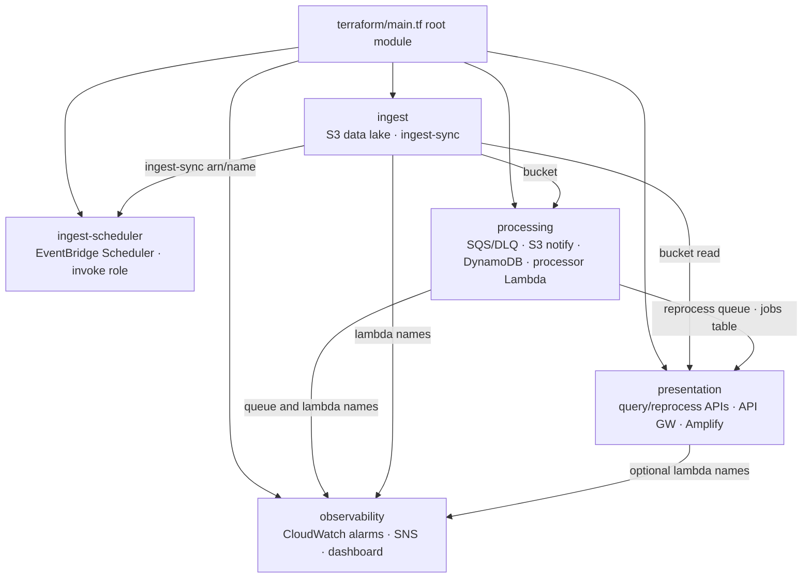

# Architecture

## Overview

This platform is a consolidated AWS event-driven serverless system for GNSS RINEX data ingestion, PyTECGg TEC calibration, and interactive visualization. It operates within a single monorepo and is provisioned through Terraform-only infrastructure-as-code.

## System Diagram

## Layers

### Ingest Layer

The ingest layer automatically synchronizes recent RINEX observation files from GeoNet's public S3 bucket into a private data lake bucket.

- **EventBridge Scheduler** — Triggers the Ingest_Sync_Lambda on a configurable UTC schedule (default: every 1 hour).
- **Ingest_Sync_Lambda** — Computes a rolling time window based on `LOOKBACK_HOURS` (default: 1), identifies DOY prefixes covering that window, lists objects from `s3://geonet-open-data/gnss/rinexhourly/`, and copies new files to the data lake under `raw/rinexhourly/{year}/{doy}/{filename}`. Skips files already present. Continues on individual errors.

### Processing Layer

The processing layer calibrates raw RINEX observations into TEC data using PyTECGg.

- **Process_Queue (SQS Standard)** — Receives S3 ObjectCreated notifications for new raw files only. Visibility timeout of 900s covers processor Lambda execution. Ingest event source mapping uses `batch_size=1`, `ReportBatchItemFailures`, and `processor_maximum_concurrency` (default 15).
- **Reprocess_Queue (SQS Standard)** — Receives reprocessing job messages from the Reprocess API. Same visibility timeout and retention as Process_Queue. Reprocess event source mapping uses `batch_size=1`, `ReportBatchItemFailures`, and `reprocess_maximum_concurrency` (default 2) so operator jobs do not starve scheduled ingest.
- **Dead_Letter_Queue** — Captures ingest messages exceeding 5 receive attempts. A CloudWatch alarm (threshold ≥ 1 message) notifies via SNS.
- **Reprocess_Dead_Letter_Queue** — Captures reprocess messages exceeding 5 receive attempts, with a separate CloudWatch alarm on the same SNS topic.
- **Processor Lambda container** — Container image (`ghcr.io/platformfuzz/tec-processor-image`, mirrored to ECR at deploy time via `scripts/sync-processor-image.sh`). Triggered directly by Process_Queue and Reprocess_Queue with separate concurrency caps (one SQS message per invocation). Reads raw RINEX from `SOURCE_PREFIX` (`raw/rinexhourly/`), parses a 4-character alphanumeric station identifier from the filename, downloads navigation files from BKG via PyTECGg, runs calibration, and writes output to `DESTINATION_PREFIX` (`processed/tec/`). Invocation timeout defaults to 900 seconds. Updates the DynamoDB Jobs_Table when a `job_id` is present in the message. Effective parallel throughput is also bounded by the account's Lambda concurrent execution quota.

### Presentation Layer

The presentation layer provides an interactive SPA for querying and visualizing processed TEC data.

- **Amplify Portal** — A Vite-based single-page application offering station browsing (alphabetically sorted, search with Enter-to-select), time-series charts (density-adaptive rendering, legend suppression above 12 satellites), IPP maps (outlier-resistant fitBounds viewport, dateline-safe longitude normalization), and a parameter panel for reprocessing.
- **API Gateway** — REST API with `/catalog` (GET), `/query` (GET), and `/reprocess` (POST, GET) endpoints. Base URL: `terraform output api_url`. Browser CORS is configured for the Amplify portal hostname only; CLI and server-side clients call the API Gateway URL directly.
- **Query_API Lambda** — Uses processed S3 key prefixes for `/catalog` station/date discovery (processed output only). For `/query`, reads Parquet and JSON output files from S3 in parallel (`QUERY_READ_WORKERS`, default 8; Parquet preferred when `pyarrow` is available; JSON used as fallback), filters by time range (max 7 days) and optional satellite, sanitizes non-finite float values (`NaN`/`Inf` → `null`), and returns JSON with truncation at `QUERY_MAX_ROWS` (default 2000) plus payload-size trimming under the Lambda synchronous response limit (~5.5 MB).
- **Reprocess_API Lambda** — Validates job parameters against a processor-defined allowlist (`NAV_DAY_OFFSET`, `SAVE_PARQUET`, `SAVE_CSV`, `SAVE_JSON`, `SAVE_STATIC_PLOTS`, `SAVE_INTERACTIVE_PLOTS`). Creates DynamoDB job records, enqueues reprocessing messages to Reprocess_Queue, and returns job status on polling.
- **DynamoDB Jobs_Table** — Tracks reprocessing jobs by `job_id` with status lifecycle: queued → processing → completed/failed.

## Infrastructure Layering

Shared resources live in the layer that owns them:

| Resource | Module | Rationale |
| --- | --- | --- |
| S3 Data Lake | `ingest` | Ingest creates and populates `raw/` |
| S3 → SQS notification | `processing` | Triggers the processing pipeline |
| SQS, DLQ | `processing` | Processor consumption and failure handling (ingest + reprocess queues) |
| CloudWatch alarms, SNS, dashboard | `observability` | Cross-layer monitoring; presentation widgets/alarms only when `enable_presentation` |
| DynamoDB Jobs table | `processing` | Processor updates job status; presentation reads via outputs |
| EventBridge Scheduler | `ingest-scheduler` | Triggers scheduled sync after explicit scheduler module apply |

## Key Design Decisions

| Decision | Rationale |
| --- | --- |
| Terraform-only provisioning | A single IaC workflow avoids duplicated infrastructure definitions and reduces drift risk. |
| Python 3.14 for zip Lambdas | Ingest, query, and reprocess use managed runtime `python3.14`. Processor runs as a Lambda container image (Python 3.13). |
| Processor as Lambda container | Keeps no-VPC operation, direct SQS consumption, and independent per-message retries while reusing the existing processor image contract. |
| External container image for processor | `ghcr.io/platformfuzz/tec-processor-image` is built and published independently; this repo consumes it as an immutable artifact mirrored to ECR. Local processor source code is not maintained here. |
| EventBridge Scheduler (not classic rules) | One-off schedules, flexible windows, and dedicated execution roles; better fit for recurring Lambda triggers than legacy EventBridge rules. |
| SQS standard queue (not FIFO) | Processing order is irrelevant; standard queues provide higher throughput and simpler configuration. |
| Parquet as primary output format | Columnar format enables efficient range scans and predicate pushdown for the Query API without a database. JSON output is also enabled as a fallback for environments where `pyarrow` is unavailable. |
| Deterministic output keys | Enables safe overwrites for idempotent reprocessing without deduplication logic. |
| Prefix-based catalog discovery | Query API derives stations/dates from `processed/tec/station=.../year=.../doy=...` key layout for scalable catalog lookups. |
| DynamoDB for job tracking | Low-latency single-item lookups by `job_id`; no relational joins needed. |
| Visibility timeout 900s | Covers processor Lambda execution and retry window for direct SQS event source mappings. |
| NaN sanitization in Query API | Python's `json.dumps` emits bare `NaN` (not valid per the JSON spec). The Query API replaces non-finite floats with `null` before serialization so all browsers can parse the response. |

## Out of Scope (removed)

The following were explored in earlier designs but are **not** part of the current Terraform deployment:

- **AWS Batch** and **batch-dispatcher** — processing is direct SQS → processor Lambda container
- **S3 Annotations** and **annotations-indexer** — catalog discovery uses processed key prefix listing instead

## Components

| Component | Location | Description |
| --- | --- | --- |
| Ingest_Sync_Lambda | `services/ingest-sync/` | Syncs RINEX files from GeoNet to the data lake on a schedule |
| Processor_Lambda | Container image (`ghcr.io/platformfuzz/tec-processor-image`) | Directly consumes SQS messages, runs PyTECGg calibration, and writes Parquet/JSON output under `processed/tec/` |
| Query_API Lambda | `services/query-api/` | Reads Parquet (preferred) or JSON output and returns filtered TEC data via REST |
| Reprocess_API Lambda | `services/reprocess-api/` | Creates reprocessing jobs with allowlisted parameters and tracks status via DynamoDB |
| Portal | `web/` | Vite SPA with station browsing, density-adaptive charts, IPP maps, and parameter controls |
| Terraform modules | `terraform/modules/` | Five modules: `ingest`, `ingest-scheduler`, `processing`, `presentation`, `observability` |

## Observability

All Lambda functions emit structured JSON logs containing:

- `trace_id` — UUID v4 for end-to-end correlation
- `duration_ms` — Processing time
- `outcome` — success or error
- `error_type` / `error_message` — On failure, the exception class and details

- Dead letter queue activity on either ingest or reprocess DLQs triggers CloudWatch alarms (`dlq-messages-visible`, `reprocess-dlq-messages-visible`) that notify via SNS.
- Additional alarms cover processor Lambda errors/throttles (`processor-lambda-errors`, `processor-lambda-throttles`), queue depth (`process-queue-messages-visible`), stale messages (`process-queue-stale-messages`, `reprocess-queue-stale-messages`), and ingest-sync errors (`ingest-sync-errors`).
- CloudWatch dashboard **`event-driven-platform`** (Terraform output `cloudwatch_dashboard_name`) shows alarm status, queue depth/age, processor Lambda throughput/concurrency, and Lambda metrics for deployed layers only.

## Deferred Hardening Backlog

The following improvements are intentionally deferred to a later iteration because they require broader design decisions or additional infrastructure:

- **DLQ reconciliation for Jobs_Table terminal status** — add a DLQ consumer or sweeper to set job-linked records to `failed` when messages age out to DLQ.
- **Dynamic scaling policies** — automatically tune processor Lambda reserved concurrency from queue depth/backlog metrics.
- **Processor payload-shape redesign** — evaluate batched payload processing before changing the currently working one-message-per-file contract.
- **Additional alert channels** — wire SNS notifications to Slack/PagerDuty/Chatbot with operational ownership and escalation policies.
